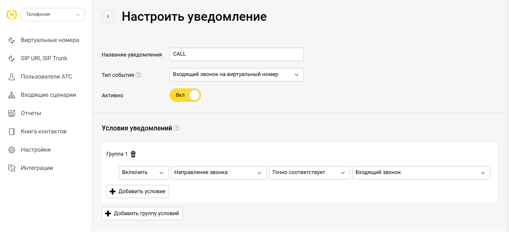
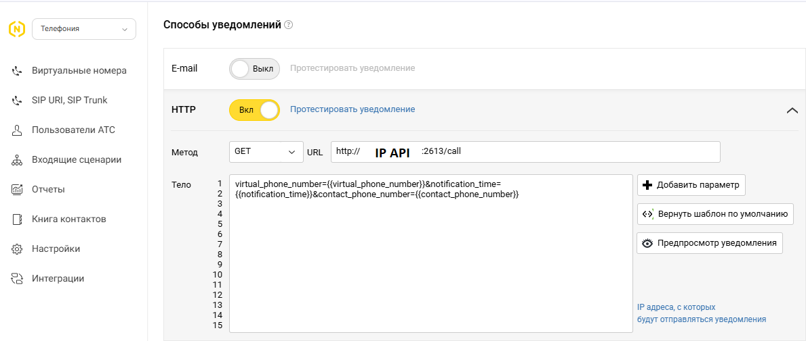
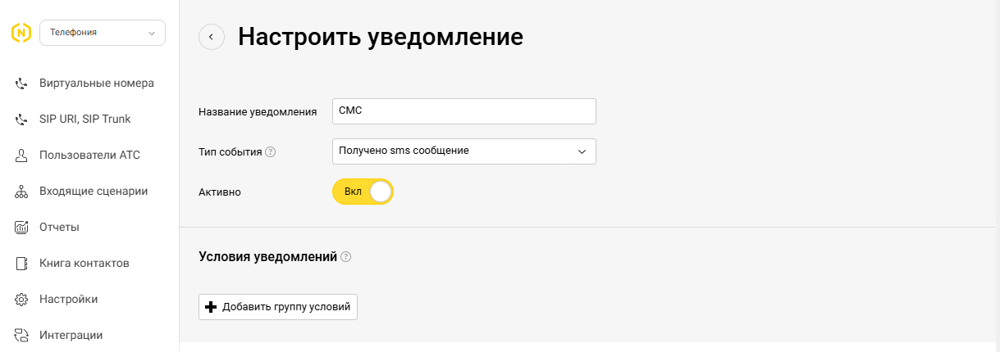
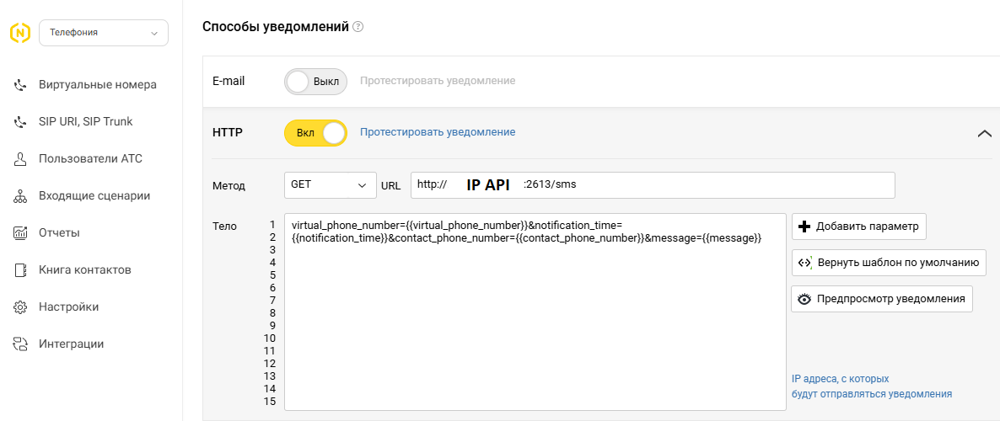

# Инструкция по настройке Novofon API и Telegram уведомлений

## 🌐 1. Покупка виртуального номера с поддержкой SMS

1. Перейдите на сайт [https://novofon.ru](https://novofon.ru)
2. Зарегистрируйтесь или войдите в личный кабинет
3. Перейдите в раздел **«Виртуальные номера»**
4. Нажмите **«Подключить номер»**
5. Выберите в поле **«Город»**: **79 - Мобильные номер**
6. Убедитесь, что чекбокс **«Включить приём СМС»** выбран
7. Завершите покупку и оплату

---

## 📞 2. Настройка Novofon API для получения звонков и SMS

### Настройка webhook на стороне Novofon

Для получения уведомлений о звонках и SMS необходимо указать `webhook URL` в личном кабинете Novofon:

1. Перейдите в **«Настройки»** >> **«Уведомления»**
2. Нажмите **«Добавить уведомление»** и укажите данные с изображений:

#### 🔔 Настройка уведомлений для звонков




**URL:**
```
http://<IP>:2613/call
```

**Тело запроса:**
```
virtual_phone_number={{virtual_phone_number}}&notification_time={{notification_time}}&contact_phone_number={{contact_phone_number}}
```

#### ✉️ Настройка уведомлений для SMS




**URL:**
```
http://<IP>:2613/sms
```

**Тело запроса:**
```
virtual_phone_number={{virtual_phone_number}}&notification_time={{notification_time}}&contact_phone_number={{contact_phone_number}}&message={{message}}
```

---

## 👥 3. Настройка группы и Telegram-бота Novofon (необязательно, но полезно для ручной авторизации)

Вы можете получать уведомления в Telegram, подключив бота `@NovofonRuBot`.

### Подключение бота

1. Найдите в Telegram пользователя **@NovofonRuBot**
2. Добавьте его в нужную группу или чат, куда будут приходить уведомления
3. Бот пришлет Вам сообщение с **chat ID**
4. Введите полученный ID в соответствующем поле на сайте или настройках проекта

---

## ✅ Готово!

Теперь Novofon настроен для получения уведомлений о звонках и сообщениях через API и Telegram.
